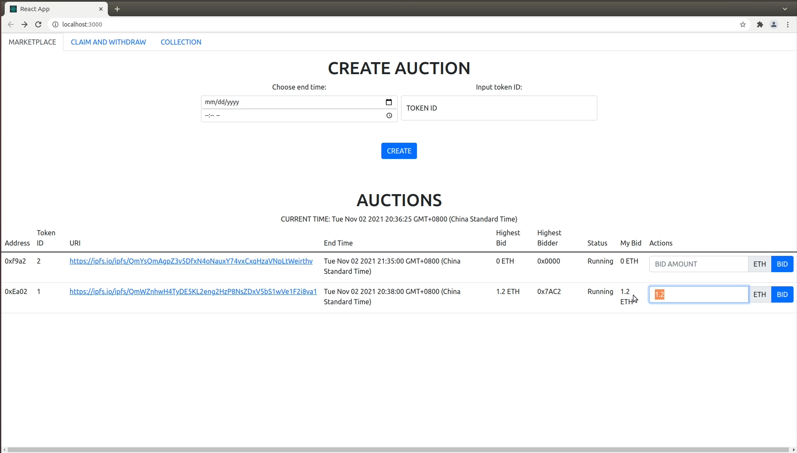
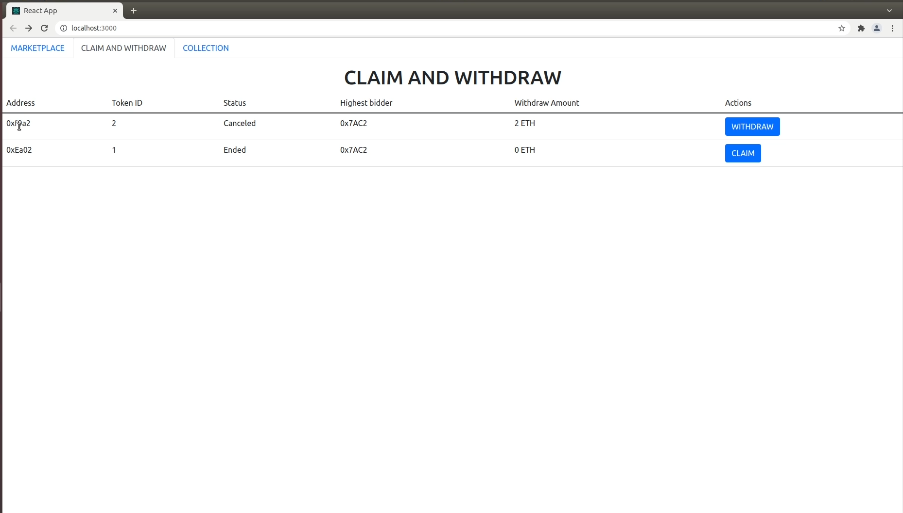
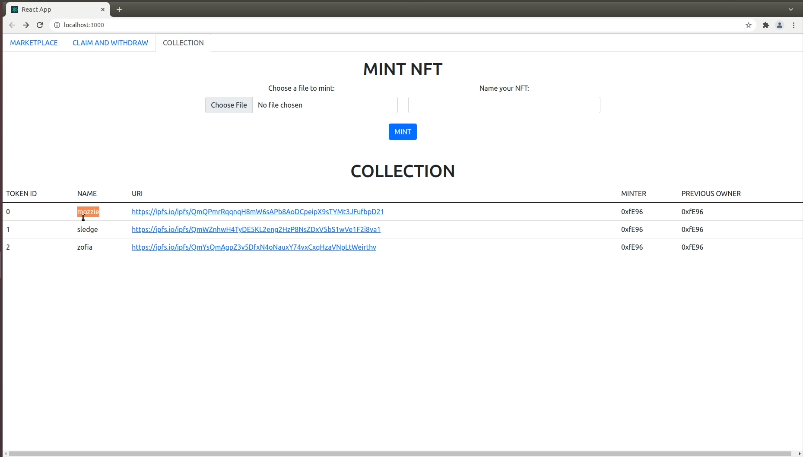

# NFT Auction

## Introduction

This is a naive implementation of an auction platform selling NFTs. Users can mint their own NFTs, create an auction for NFT, set an end time of the auction and bid with ETH.

Here we have some screenshots of this app.

## Implementation (React + Solidity + truffle)

This application is implemented using **Solidity** and migrated using **truffle (ganache)**. As for front-end, **React** is utilized.

## Running

Since this application is made with truffle and React, make sure you have both these two tools installed. Checkout their official website to know how to install.

These application also utilized **react-bootstrap** and **OpenZeppelin** to implement and the `node_modules` folder containing these two dependencies is not included in this repo. So if you want to run this application yourself, you also have to install these dependencies yourself. Please do the following to run.

0. clone this repo
1. `$ npm install @openzeppelin/contracts`
2. make sure you have your **ganache** running on `localhost:7545`
3. `$ truffle migrate --reset` - Migrate the smart contracts
4. `$ cd client` - The React App is in this folder
5. `$ npm install react-bootstrap`
6. `$ npm start`

